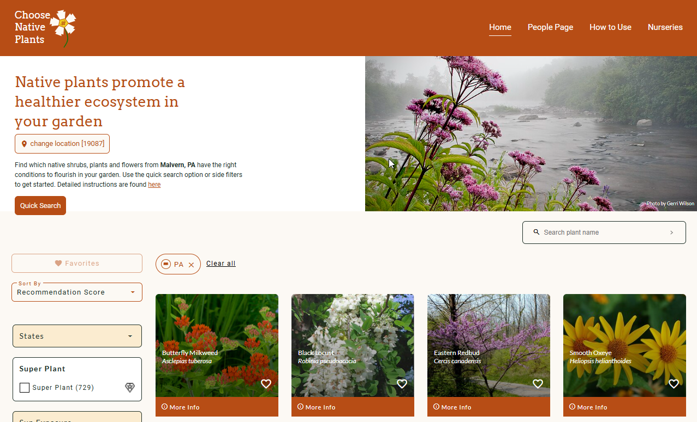

# Choose Native Plants

[Choose Native Plants](https://choose-native-plants.com) helps US residents find native plants for their gardens and locate nearby nurseries that sell them.



## What it does

- Searches and filters plants by growing conditions and ecological value
- Shows plant details, native range, and local availability
- Includes a garden planner and favorites
- Supports desktop and mobile browsers

The app uses Vue 3, Node.js/Express, and MongoDB. Plant data originates in shared Google Sheets, images live in Linode Object Storage, and nursery availability comes from Plant Agents.

## Local development

### Prerequisites

- Node.js 20 LTS (the version used by the Docker image)
- MongoDB Community Server, running locally
- [MongoDB Database Tools](https://www.mongodb.com/try/download/database-tools) (`mongorestore`)
- [AWS CLI](https://docs.aws.amazon.com/cli/latest/userguide/getting-started-install.html), needed only to restore a database backup
- Access to the project's shared environment values

`mongosh` is useful for inspecting the database but is not required to run the app.

On Windows, these can be installed with:

```powershell
winget install OpenJS.NodeJS.LTS
winget install MongoDB.Server
winget install MongoDB.DatabaseTools
winget install Amazon.AWSCLI
```

After installing, open a new terminal so `node`, `mongorestore`, and `aws` are available on `PATH`.

### First-time setup

```bash
git clone https://github.com/CodeForPhilly/pa-wildflower-selector
cd pa-wildflower-selector
npm ci
cp .env.example .env
```

Ask in the Code for Philly `#choose-native-plants-pa` Slack channel for the private values, then edit `.env` for native local development:

```dotenv
DB_HOST=localhost
DB_PORT=27017
DB_NAME=pa-wildflower-selector
PORT=8080
```

If your local MongoDB does not use authentication, leave `MONGODB_USER` and `MONGODB_PASSWORD` blank. Keep all real credentials in `.env`; it is ignored by Git.

Download the image library:

```bash
npm run sync-images
```

This command uses the project's AWS SDK and does not require the AWS CLI. It downloads into the ignored `images/` directory and safely skips files that are already current.

Restore the latest shared database backup:

```bash
npm run sync:down:db
```

Database restore requires both `aws` and `mongorestore` to be available on `PATH`. MongoDB does not support every cross-version dump/restore combination; use a server version compatible with the backup when `mongorestore` reports a version warning.

Check the setup and start both servers:

```bash
npm run dev:local
```

Open [http://localhost:8080](http://localhost:8080). The Vue development server runs on port 8080 and proxies API and image requests to Express on port 3000.

The first backend start may take a few minutes while missing plant embeddings are generated. Later starts should be quick.

## Docker

Docker remains available for a containerized environment:

```bash
cp .env.example .env
# Set DB_HOST=mongodb and add the private values.
npm run docker:up
```

Open [http://localhost:6868](http://localhost:6868), or the value configured by `NODE_LOCAL_PORT`.

```bash
npm run docker:down
```

The Compose stack pins MongoDB 5.0.6. Local development is often more convenient when working directly with sync and database tools.

## Useful commands

| Command | Purpose |
| --- | --- |
| `npm run dev:local` | Validate local setup and run client + server |
| `npm run dev:client` | Run only the Vue client |
| `npm run dev:server` | Run only Express on port 3000 |
| `npm run sync-images` | Download Linode images |
| `npm run sync:down:db` | Download and restore the latest database backup |
| `npm run sync:plantagents -- --dry-run` | Validate PlantAgents Neon data without publishing |
| `npm run sync:plantagents` | Publish PlantAgents vendors, availability, and ZIP data to MongoDB |
| `npm run fast-update-data` | Refresh plant data from the source sheets |
| `npm run lint` | Run lint checks |
| `npm run build` | Build SSR and browser bundles |
| `npm run docker:up` | Build and start the Compose stack |
| `npm run docker:down` | Stop the Compose stack |

Run `npm run` to see the complete script list, including schema, index, embedding, and upload utilities.

## Environment and ports

| Setting | Native local | Docker |
| --- | --- | --- |
| `DB_HOST` | `localhost` | `mongodb` |
| `DB_PORT` | `27017` | `27017` |
| Browser URL | `http://localhost:8080` | `http://localhost:6868` |
| Express port | `3000` | Value of `PORT` |
| MongoDB host port | `27017` | Value of `MONGODB_LOCAL_PORT` |

Never commit `.env`, downloaded images, database backups, or `node_modules`. They are already covered by `.gitignore`.

## PlantAgents nursery data sync

Choose Native Plants serves nursery availability and location lookups from MongoDB. The sync job is the only component that connects to PlantAgents PostgreSQL; normal web requests never contact Neon or the legacy PlantAgents API.

Set `PLANTAGENTS_DATABASE_URL` in `.env` to a Neon role with read-only access to `vendors`, `plants`, `vendor_current_plant_offerings`, and `zip_code_geographies`. Validate and publish with:

Create the Neon role as an administrator, substitute a generated password, and keep the password out of source control:

```sql
CREATE ROLE choose_native_plants_sync LOGIN PASSWORD '<generated-password>';
GRANT CONNECT ON DATABASE neondb TO choose_native_plants_sync;
GRANT USAGE ON SCHEMA public TO choose_native_plants_sync;
GRANT SELECT ON TABLE public.vendors,
  public.plants,
  public.vendor_current_plant_offerings,
  public.zip_code_geographies
TO choose_native_plants_sync;
```

Do not grant membership in the crawler role or write privileges. If the PlantAgents views are recreated by a migration, reapply their `SELECT` grants as part of that migration.

```bash
npm run sync:plantagents -- --dry-run
npm run sync:plantagents
```

The command stages a complete snapshot, validates counts and plant-name matches, then atomically selects it as active. Neon currently provides ZIP centroids but not city/state labels, so the sync fills missing labels from the bundled BSD-licensed `zipcodes` dataset and records that provenance on each MongoDB row. More than a 20% source-count drop or a high unmatched-plant ratio fails without changing live data. Use `--force` only after reviewing an intentional upstream change. The previous successful snapshot is retained for rollback; restore it by updating the `plantagents-active` document's `activeSnapshotId` in `plantagents_sync_state`.

The final output line is JSON suitable for job logs. `/api/v1/plantagents-sync-status` reports freshness and counts without exposing credentials.

In Kubernetes, create a `plantagents-postgres` SealedSecret containing `PLANTAGENTS_DATABASE_URL`, run the CronJob once manually, then set `plantagentsSync.enabled: true`. The default `0 7 * * 0` schedule is Sunday 07:00 UTC (3:00 AM EDT / 2:00 AM EST). Rotate the credential by resealing that secret; no application configuration changes are required.

## Troubleshooting

### MongoDB check fails

- Confirm the MongoDB service is running.
- Confirm `DB_HOST=localhost` and `DB_PORT` matches the local service.
- If authentication is disabled locally, clear `MONGODB_USER` and `MONGODB_PASSWORD`.
- Run `node scripts/check-mongodb.js` for a focused connection check.

### Client loads but data requests fail

- Confirm Express is listening on port 3000.
- Confirm the database has been restored with `npm run sync:down:db`.
- Do not give the local client and server the same port.
- Use `npm run dev:local`; its scripts reserve 8080 for Vue and 3000 for Express.
- If the browser shows the app shell but plant requests return 500s, check MongoDB first. A common cause is leaving Docker defaults in `.env`, especially `DB_HOST=mongodb` or non-empty Mongo credentials when the local service has no authentication.

### Sync command is missing a program

- Image sync needs Node.js and the `.env` Linode values.
- Database sync additionally needs AWS CLI and MongoDB Database Tools on `PATH`.
- Restart the terminal after installing Windows packages so its `PATH` refreshes.

### First backend start is slow

The first local backend start may generate missing plant embeddings after the database restore. Wait for the server log to finish that work and print `Listening on port 3000`; later starts should be much faster.

## Project layout

- `src/` — Vue application
- `app.js`, `lib/` — Express server and database access
- `scripts/` — sync, migration, indexing, embedding, and maintenance tools
- `public/` — static assets bundled with the app
- `images/` — downloaded plant images; ignored by Git
- `helm-chart/`, `deployment/` — deployment configuration

The development-only studio image pipeline is documented in [`scripts/studio_images/README.md`](scripts/studio_images/README.md).

## Contributing

1. Create a feature branch.
2. Make and verify a focused change.
3. Commit and push the branch.
4. Open a pull request.

Questions are welcome in the Code for Philly project channel or at [contact@choosenativeplants.com](mailto:contact@choosenativeplants.com).

This project is licensed under the [MIT License](LICENSE).
